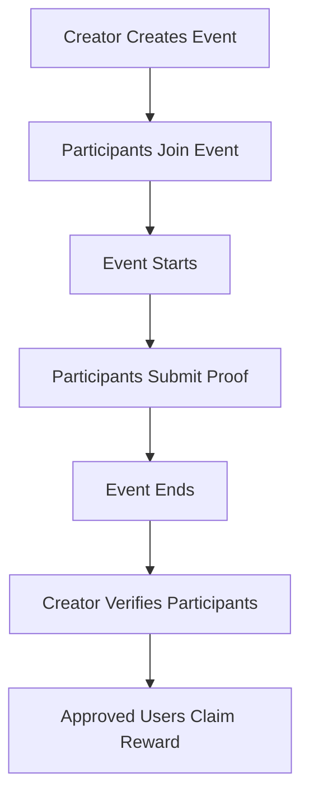

# SuiLife Smart Contracts

<div align="center">


**A blockchain-powered quest platform built on Sui Network**

[Overview](#-overview) •
[Architecture](#-architecture) •
[Contracts](#-smart-contracts) •
[Getting Started](#-getting-started) •
[User Flow](#-user-flow)

</div>

---

## 🎯 Overview

SuiLife is a blockchain-based quest/mission platform on Sui that enables:

- **Creators** to create events/missions with SUI rewards
- **Participants** to join and complete real-life missions
- **Verification** by creators to validate participants
- **Rewards** claimed directly by verified participants

The platform incentivizes real-life activities like exercise, healthy habits, and productivity challenges with crypto rewards.

---

## 🏗 Architecture

```
SC/
├── suilife/                    # Core platform contracts
│   ├── sources/
│   │   ├── event.move          # Event/Quest management logic
│   │   └── vault.move          # SUI reward vault management
│   └── tests/
│       └── suilife_tests.move  # Test suite
│
└── token/                      # LIFE Token contracts
    ├── sources/
    │   └── token.move          # LIFE Token implementation
    └── tests/
        └── token_tests.move    # Token test suite
```

---

## 📜 Smart Contracts

### 1. LIFE Token (`token::life_token`)

Platform utility token with features:

| Feature      | Description                             |
| ------------ | --------------------------------------- |
| **Symbol**   | LIFE                                    |
| **Decimals** | 9                                       |
| **Purchase** | Buy LIFE with SUI (1000 LIFE per SUI)   |
| **Utility**  | Required to create events (10 LIFE fee) |

**Functions:**

- `buy_life()` - Purchase LIFE tokens with SUI
- `admin_mint()` - Admin mint tokens (restricted)
- `admin_burn()` - Admin burn tokens (restricted)

---

### 2. Event Management (`suilife::event`)

Core contract for managing quests/missions:

**Core Functions:**

| Function                | Actor       | Description                       |
| ----------------------- | ----------- | --------------------------------- |
| `create_event()`        | Creator     | Create a new event with rewards   |
| `join_event()`          | Participant | Join an event                     |
| `submit_proof()`        | Participant | Submit proof of completion        |
| `verify_participants()` | Creator     | Verify approved participants      |
| `claim_reward()`        | Participant | Claim reward (after verification) |

---

### 3. Vault (`suilife::vault`)

Secure storage for SUI rewards:

- Safely stores SUI rewards
- Handles withdrawals for approved participants
- Tracks claimed status

---

## 🚀 Getting Started

### Prerequisites

- [Sui CLI](https://docs.sui.io/build/install) installed
- Sui wallet with testnet SUI

### Build Contracts

```bash
# Build LIFE Token
cd token
sui move build

# Build SuiLife core
cd ../suilife
sui move build
```

### Run Tests

```bash
# Test token
cd token
sui move test

# Test suilife
cd ../suilife
sui move test
```

### Deploy to Testnet

```bash
# Deploy token first
cd token
sui client publish

# Deploy suilife (update token address in Move.toml)
cd ../suilife
sui client publish
```

---

## 🔄 User Flow



### Step-by-step:

1. **Create Event** - Creator creates a mission with SUI reward deposit + 10 LIFE fee
2. **Join Event** - Participants join before the event ends
3. **Submit Proof** - Participants submit proof (link/IPFS) during the event
4. **Verify** - Creator reviews and approves successful participants
5. **Claim** - Approved participants claim their individual rewards

---

## 💰 Token Economics

| Item                | Amount                               |
| ------------------- | ------------------------------------ |
| Event Creation Fee  | 10 LIFE (burned)                     |
| LIFE Purchase Rate  | 1000 LIFE per 1 SUI                  |
| Reward Distribution | Equal split to verified participants |

---

## 📦 Deployed Contracts (Testnet)

| Contract       | Package ID                                                           |
| -------------- | -------------------------------------------------------------------- |
| **LIFE Token** | `0x69f585ff94a49807d1b385d7e05a08cc01f5622ade69fee17aa6d885b545b0a6` |
| **SuiLife**    | `0x3743b6e4b471ec0c878c3e9a243e3c97392ed0824402dd27f6084fd2ae558bc1` |

---

## 📄 License

This project is licensed under the MIT License.

---

<div align="center">
  <b>Built with ❤️ on Sui Network</b>
</div>
