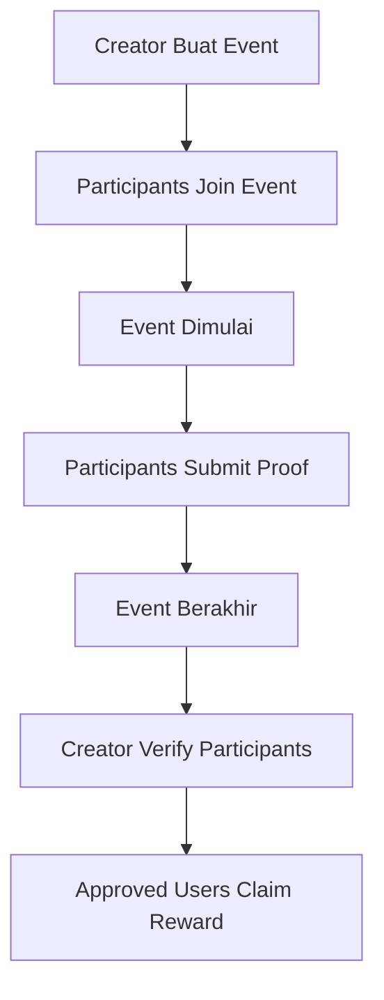

# SuiLife - User Flow Documentation

## Overview

SuiLife adalah platform quest/misi berbasis blockchain Sui dimana:

- **Creator** membuat event/misi dengan reward SUI
- **Participants** bergabung dan menyelesaikan misi
- **Creator** memverifikasi partisipan yang berhasil
- **Verified participants** mengklaim reward mereka masing-masing

---

## 📊 Diagram Flow



---

## 1️⃣ Create Event (Buat Event)

### Siapa: Event Creator

### Fungsi: `create_event()`

### Input yang Diperlukan:

| Parameter          | Tipe               | Deskripsi                           | Contoh                                                    |
| ------------------ | ------------------ | ----------------------------------- | --------------------------------------------------------- |
| `name`             | `vector<u8>`       | Nama event/misi                     | `b"Morning Run Challenge"`                                |
| `description`      | `vector<u8>`       | Deskripsi lengkap misi              | `b"Lari pagi 5km selama event berlangsung"`               |
| `instructions`     | `vector<u8>`       | Instruksi cara menyelesaikan        | `b"1. Buka app tracking 2. Lari 5km 3. Screenshot hasil"` |
| `image_url`        | `vector<u8>`       | URL gambar event                    | `b"https://example.com/event.png"`                        |
| `reward_amount`    | `u64`              | Total reward dalam SUI (dalam MIST) | `1_000_000_000` (= 1 SUI)                                 |
| `start_time`       | `u64`              | Waktu mulai (timestamp ms)          | `1706400000000`                                           |
| `end_time`         | `u64`              | Waktu berakhir (timestamp ms)       | `1706486400000`                                           |
| `max_participants` | `u64`              | Maksimal peserta                    | `100`                                                     |
| `sui_payment`      | `Coin<SUI>`        | Coin SUI untuk reward + sisa        | Minimal = `reward_amount`                                 |
| `life_fee`         | `Coin<LIFE_TOKEN>` | Fee dalam LIFE token                | Harus **10 LIFE** (`10_000_000_000`)                      |

### Yang Terjadi:

1. ✅ Validasi LIFE fee = 10 LIFE (diburn ke `0x0`)
2. ✅ SUI reward dipotong dari payment, sisanya dikembalikan ke creator
3. ✅ Vault dibuat untuk menyimpan reward SUI
4. ✅ Event object dibuat dan di-share
5. ✅ Creator menerima **EventNFT** sebagai bukti kepemilikan

### Output:

- `Event` (shared object)
- `Vault` (shared object)
- `EventNFT` → dikirim ke creator

---

## 2️⃣ Join Event (Gabung Event)

### Siapa: Participant

### Fungsi: `join_event()`

### Input yang Diperlukan:

| Parameter | Tipe         | Deskripsi                             |
| --------- | ------------ | ------------------------------------- |
| `event`   | `&mut Event` | Reference ke event yang ingin diikuti |
| `clock`   | `&Clock`     | Sui system clock                      |

### Validasi:

- ❌ Event belum berakhir (`now < end_time`)
- ❌ Event belum penuh (`current_participants < max_participants`)
- ❌ User belum pernah join

### Yang Terjadi:

1. ✅ User ditambahkan ke daftar `participants`
2. ✅ Counter `current_participants` bertambah
3. ✅ Status event berubah ke `RUNNING` jika sudah melewati `start_time`
4. ✅ User menerima **Participant NFT**

### Output:

- `Participant` NFT → dikirim ke user

---

## 3️⃣ Submit Proof (Kirim Bukti)

### Siapa: Participant yang sudah join

### Fungsi: `submit_proof()`

### Input yang Diperlukan:

| Parameter | Tipe         | Deskripsi               | Contoh                                                          |
| --------- | ------------ | ----------------------- | --------------------------------------------------------------- |
| `event`   | `&mut Event` | Reference ke event      | -                                                               |
| `proof`   | `vector<u8>` | Bukti penyelesaian misi | `b"ipfs://QmXxx..."` atau `b"https://screenshot.com/proof.jpg"` |
| `clock`   | `&Clock`     | Sui system clock        | -                                                               |

### Validasi:

- ❌ Event sudah dimulai (`now >= start_time`)
- ❌ Event belum berakhir (`now <= end_time`)
- ❌ User adalah participant

### Yang Terjadi:

1. ✅ Status event diupdate ke `RUNNING` jika masih `PENDING`
2. ✅ **Submission NFT** dibuat dengan proof
3. ✅ Submission dikirim ke user

### Output:

- `Submission` NFT → dikirim ke user

### Catatan:

> Proof bisa berupa link gambar, hash IPFS, atau data lain yang membuktikan misi selesai. Creator akan mereview proof ini secara off-chain.

---

## 4️⃣ Verify Participants (Verifikasi Peserta)

### Siapa: Event Creator ONLY

### Fungsi: `verify_participants()`

### Input yang Diperlukan:

| Parameter            | Tipe              | Deskripsi                           | Contoh                     |
| -------------------- | ----------------- | ----------------------------------- | -------------------------- |
| `event`              | `&mut Event`      | Reference ke event                  | -                          |
| `approved_addresses` | `vector<address>` | Daftar alamat yang lolos verifikasi | `vector[@0x1, @0x2, @0x3]` |
| `clock`              | `&Clock`          | Sui system clock                    | -                          |

### Validasi:

- ❌ Caller adalah creator event
- ❌ Event sudah berakhir (`now > end_time`)
- ❌ Event belum pernah diverifikasi
- ❌ Minimal 1 address di-approve

### Yang Terjadi:

1. ✅ `reward_per_person` dihitung: `reward_amount / jumlah_approved`
2. ✅ Daftar `approved_participants` diset
3. ✅ Status event berubah ke `VERIFIED`

### Contoh Kalkulasi Reward:

```
Total Reward: 10 SUI (10_000_000_000 MIST)
Approved: 4 orang
Reward per person: 10 / 4 = 2.5 SUI per orang
```

---

## 5️⃣ Claim Reward (Klaim Hadiah)

### Siapa: Approved Participant

### Fungsi: `claim_reward()`

### Input yang Diperlukan:

| Parameter | Tipe         | Deskripsi                |
| --------- | ------------ | ------------------------ |
| `event`   | `&mut Event` | Reference ke event       |
| `vault`   | `&mut Vault` | Reference ke vault event |

### Validasi:

- ❌ Event sudah `VERIFIED`
- ❌ Vault ID cocok dengan event
- ❌ User ada di daftar `approved_participants`
- ❌ User belum pernah claim

### Yang Terjadi:

1. ✅ Reward diambil dari vault
2. ✅ User ditandai sudah claim (`claimed_participants`)
3. ✅ `total_claimed` diupdate
4. ✅ **SUI Coin** dikirim ke user

### Catatan Pembagian:

> Claimer terakhir mendapat sisa yang tersisa di vault (untuk handle pembulatan). Contoh: jika reward 10 SUI dibagi 3 orang, 2 orang pertama dapat 3.333... SUI, orang terakhir dapat 3.334 SUI.

---

## 📋 Status Event

| Status     | Kode | Deskripsi                                     |
| ---------- | ---- | --------------------------------------------- |
| `PENDING`  | 0    | Event dibuat, belum dimulai                   |
| `RUNNING`  | 1    | Event sedang berlangsung                      |
| `ENDED`    | 2    | Event sudah berakhir, belum diverifikasi      |
| `VERIFIED` | 3    | Creator sudah verifikasi, reward bisa diklaim |


## 📦 Objects & NFTs

### Shared Objects (dapat diakses siapa saja):

- **Event** - Data event utama
- **Vault** - Menyimpan reward SUI

### Owned Objects (milik user tertentu):

- **EventNFT** - Bukti kepemilikan event (untuk creator)
- **Participant** - Bukti ikut serta dalam event
- **Submission** - Bukti pengumpulan proof

---

## 💰 Token Economics

### LIFE Token Fee

- Setiap pembuatan event membutuhkan **10 LIFE** sebagai fee
- LIFE token di-transfer ke address `0x0` (burned)

### SUI Reward

- Creator menyediakan total reward dalam SUI
- Reward disimpan di Vault sampai event selesai
- Dibagi rata ke semua approved participants

---

## 🔄 Complete Example Flow

```
1. Alice (Creator) punya ide misi "Jalan 10.000 langkah"
   ↓
2. Alice panggil create_event():
   - name: "10K Steps Challenge"
   - reward: 5 SUI
   - max_participants: 50
   - start: Besok jam 6 pagi
   - end: 3 hari kemudian
   - Bayar: 5 SUI + 10 LIFE
   ↓
3. Bob, Carol, Dave join event (join_event)
   ↓
4. Event dimulai, mereka jalan dan tracking langkah
   ↓
5. Bob dan Carol submit bukti screenshot (submit_proof)
   Dave tidak submit
   ↓
6. Event berakhir
   ↓
7. Alice review submissions:
   - Bob: ✅ 10.500 langkah (approved)
   - Carol: ✅ 11.200 langkah (approved)
   - Dave: ❌ tidak submit (tidak di-approve)
   ↓
8. Alice panggil verify_participants([Bob, Carol])
   - reward_per_person = 5 SUI / 2 = 2.5 SUI
   ↓
9. Bob claim_reward() → dapat 2.5 SUI
   Carol claim_reward() → dapat 2.5 SUI
   Dave tidak bisa claim (tidak approved)
```

---

## 📝 View Functions (Read-Only)

| Fungsi                             | Return             | Deskripsi                        |
| ---------------------------------- | ------------------ | -------------------------------- |
| `get_participants(event)`          | `&vector<address>` | Daftar semua participant         |
| `get_approved_participants(event)` | `&vector<address>` | Daftar participant yang approved |
| `get_claimed_participants(event)`  | `&vector<address>` | Daftar yang sudah claim          |
| `get_status(event)`                | `u8`               | Status event saat ini            |
| `get_current_participants(event)`  | `u64`              | Jumlah participant saat ini      |
| `get_max_participants(event)`      | `u64`              | Kapasitas maksimal               |
| `is_event_full(event)`             | `bool`             | Apakah event sudah penuh         |
| `get_creator(event)`               | `address`          | Address creator                  |
| `get_reward_amount(event)`         | `u64`              | Total reward                     |
| `get_reward_per_person(event)`     | `u64`              | Reward per orang                 |
| `get_total_claimed(event)`         | `u64`              | Total yang sudah diklaim         |
| `has_user_claimed(event, user)`    | `bool`             | Apakah user sudah claim          |
| `is_user_approved(event, user)`    | `bool`             | Apakah user di-approve           |
